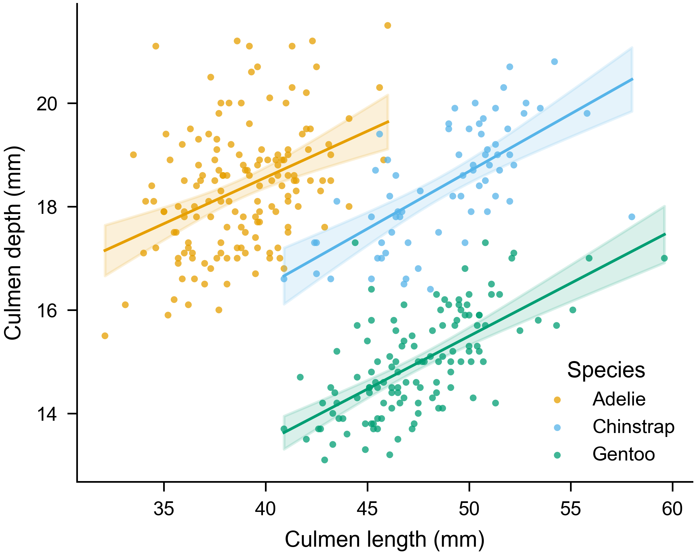
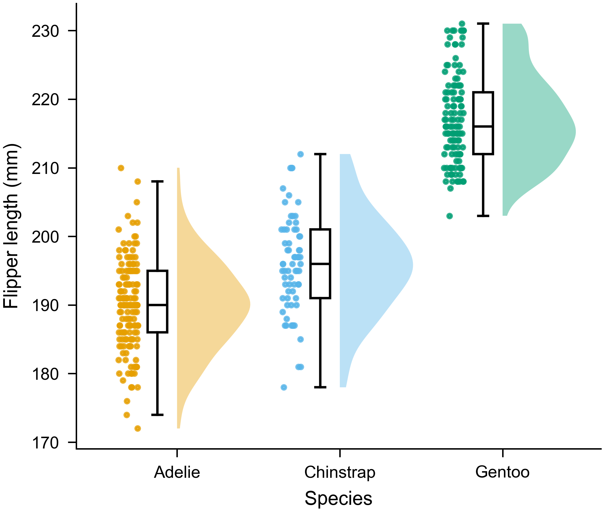
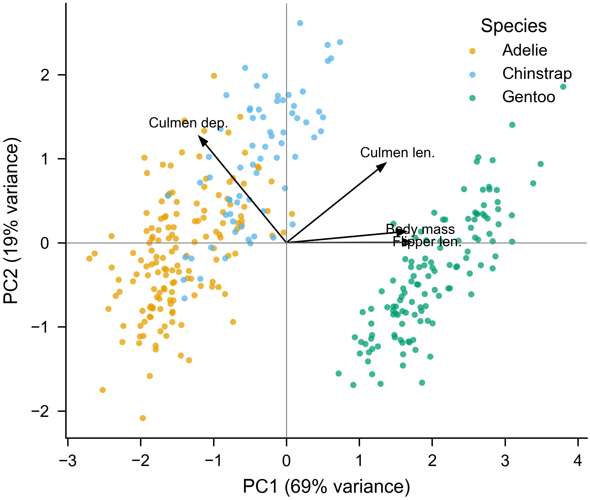
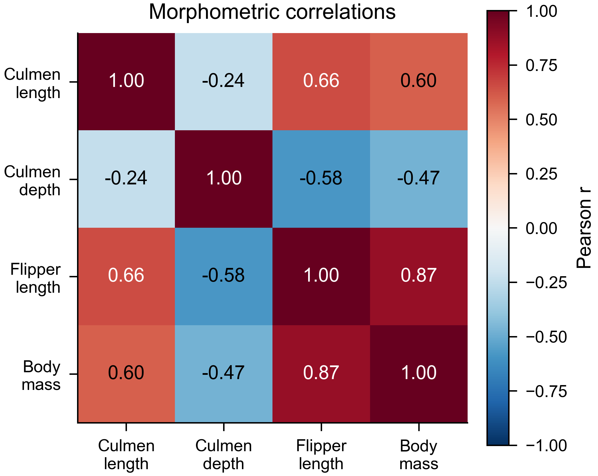
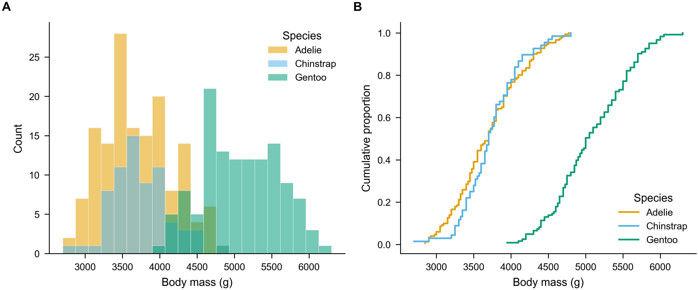
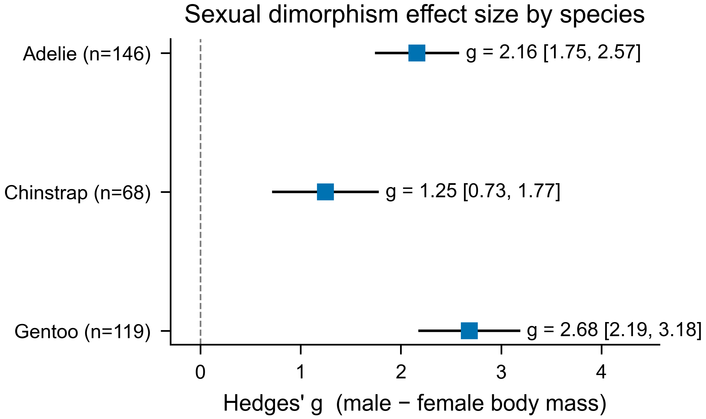
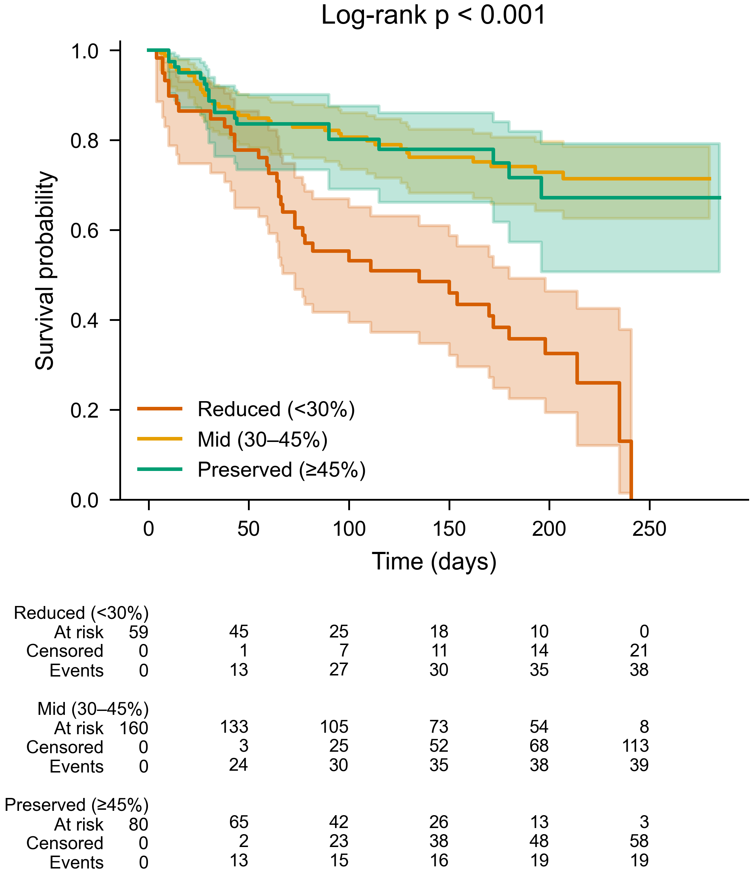
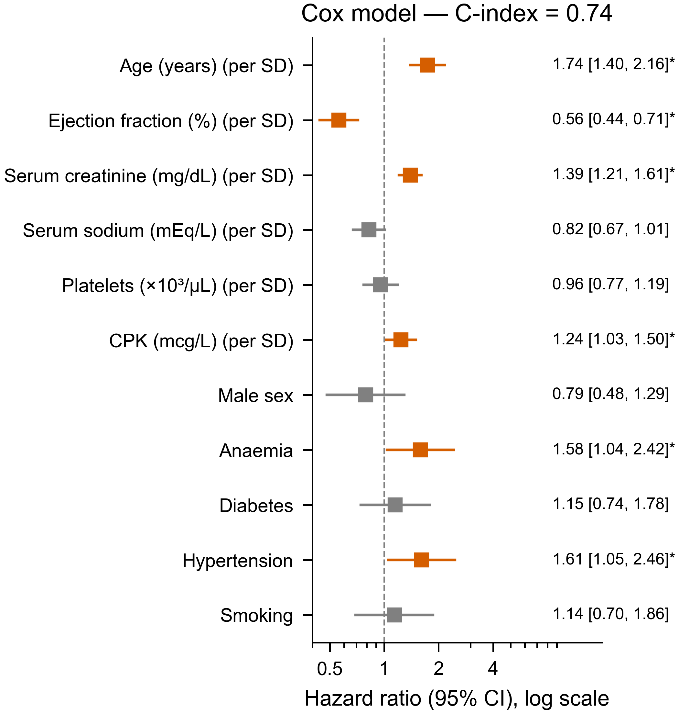
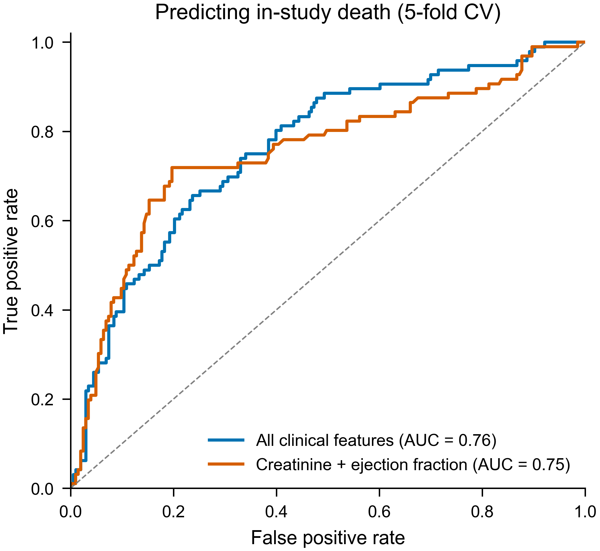

<div align="center">

**English** · [中文](README.zh-CN.md)

# 📊 paper-figures

### Turn your paper's raw data into publication-ready figures & tables — with one AI skill.

[](https://claude.com/claude-code)
[](https://www.python.org/)
[](LICENSE)
[](#-output-language)
[](#-reproducibility)

</div>

---

**paper-figures** is a [Claude](https://claude.com/claude-code) skill that takes a manuscript and
its **raw data** and produces the figures and tables a journal will accept. Every result comes from
genuine statistical computation on your own data, and each chart is chosen to fit what the paper
sets out to argue. Figures are drawn by plotting code (matplotlib, seaborn, and friends), so the
whole pipeline is free of any generative image model and stays well clear of the AI
image-generation line — every pixel traces back to a number in your dataset. The skill reads the
paper, finds where visuals are needed, picks the right statistics and chart for the data, applies
the target journal's formatting, renders, **checks its own output by looking at the rendered
image**, exports numbered assets, and hands you a Word report — in **English, Chinese, or
bilingual** — with every caption, annotation, and in-text citation location.

---

## ✨ Highlights

- 🛡️ **Real computation, not generated images** — figures come from statistical analysis and plotting code run on your raw data. The pipeline uses no generative image model, so results are traceable, reproducible, and stay clear of the AI image-generation line.
- 🔬 **Data-first & honest** — every figure reveals what is *already true* in your data. Axes keep a faithful baseline, sample sizes and error definitions are stated, and p-values are computed from the data.
- 📈 **The right chart, chosen for you** — a built-in decision guide maps your data's *shape* + your *claim* to the correct chart and statistical test.
- 🎓 **Journal-ready formatting** — configurable presets (Nature / Science / Cell / IEEE / Elsevier / PLOS + a generic default): column widths, fonts, dpi, colorblind-safe palettes.
- 🧬 **Vector output with editable text** — figures export as true vector PDF (and SVG/EPS), with fonts embedded so every label stays selectable and editable for a typesetter; a high-dpi raster (PNG/TIFF) ships alongside for quick preview.
- 📐 **Academic three-line tables (三线表)** in Word, the standard format reviewers expect.
- 🌏 **Output language is your choice** — English-only, Chinese-only, or bilingual captions & reports.
- 🧰 **Full plotting stack** — matplotlib · seaborn · plotnine · plotly, plus lifelines & scikit-learn for survival/ML.
- ♻️ **100% reproducible** — fixed seeds, saved scripts, recorded versions.

---

## 🖼 See it in action

Two complete, end-to-end runs on **real, openly-licensed published papers** live in
[`examples/`](examples/) — raw data in, the figures and a Word report below out. Every image here
was produced by the skill from the cited paper's own data.

### 🐧 Example 1 — Chart *variety* (Antarctic penguins)
**9 figures across 9 chart families + 3 three-line tables** ·
[explore ↗](examples/penguins-sexual-dimorphism/) ·
[📄 report](examples/penguins-sexual-dimorphism/Figure_Report.docx)

| Scatter + regression | Raincloud | PCA biplot |
|:---:|:---:|:---:|
|  |  |  |
| **Correlation heatmap** | **Histogram + ECDF** | **Forest plot** |
|  |  |  |

### 🫀 Example 2 — Statistical *depth* (heart-failure survival)
**Kaplan–Meier · Cox regression · cross-validated ROC + 2 three-line tables** ·
[explore ↗](examples/heart-failure-survival/) · reports:
[EN](examples/heart-failure-survival/Figure_Report_EN.docx) ·
[bilingual](examples/heart-failure-survival/Figure_Report.docx) ·
[中文](examples/heart-failure-survival/Figure_Report_ZH.docx)

| Kaplan–Meier + risk table | Cox hazard ratios | Cross-validated ROC |
|:---:|:---:|:---:|
|  |  |  |

---

## 🎯 The 7-stage workflow

The skill is a disciplined workflow, not a one-shot prompt — the same path a careful analyst takes.

| | Stage | What happens |
|---|---|---|
| 1️⃣ | **Read the paper** | Understand the study; list every place a figure/table would strengthen it. |
| 2️⃣ | **Frame the figure** | One sentence: *"This figure shows that ___."* Then locate the exact raw data. |
| 3️⃣ | **Analyze & decide** | Pick the statistic + chart from the data's shape and the claim. |
| 4️⃣ | **Check standards** | Apply the target journal's preset (size, fonts, dpi, format). |
| 5️⃣ | **Plot** | Write & *run* Python to render the real figure. |
| 6️⃣ | **Self-check** | **Open the rendered image and verify** the loop closes — labels, units, *n*, significance. |
| 7️⃣ | **Export & report** | Numbered assets + a Word report (captions, annotations, citation locations) in your chosen language. |

---

## 💪 Why it's different

| | Typical "make me a chart" | **paper-figures** |
|---|---|---|
| Source | screenshots / made-up numbers | **your raw data, via runnable code** |
| How it's made | sometimes a generative image model guessing pixels | **statistical computation + plotting code; every pixel traces to your data** |
| Chart choice | whatever's default | **matched to data shape + claim** |
| Statistics | often skipped or wrong | **design-appropriate tests, computed, reported** |
| Honesty | truncated axes, hidden n | **enforced: zero-baseline bars, stated n & error** |
| Journal fit | manual fiddling | **one preset, applied consistently** |
| Self-review | none | **reads its own rendered image before exporting** |
| Deliverable | a PNG | **numbered vector + raster + a Word report** |
| Reproducible | no | **fixed seeds + saved scripts** |

---

## 🌐 Output language

Tell Claude which language you want the captions, annotations and report in — or let it infer
from your manuscript:

- **English only** — international journal / English manuscript
- **中文 only** — Chinese thesis or journal
- **Bilingual** — captions in both (great while drafting or for a bilingual team)

See the heart-failure example for the same report rendered
[in English](examples/heart-failure-survival/Figure_Report_EN.docx),
[bilingual](examples/heart-failure-survival/Figure_Report.docx), and
[in Chinese](examples/heart-failure-survival/Figure_Report_ZH.docx).

---

## 🚀 Install & deploy

It's a self-contained **Agent Skill** — the `paper-figures/` folder holds a standard `SKILL.md`
(YAML + Markdown) plus Python scripts and assets, with no agent-specific runtime. The same folder
drops into any major agent that supports skills.

**1. Get the skill:**

```bash
git clone https://github.com/DRZ-hang/paper-figures.git
```

**2. Put the `paper-figures/` folder where your agent looks for skills:**

- **Claude Code** — `~/.claude/skills/` (all projects) or a project's `.claude/skills/`:
  ```bash
  cp -r paper-figures/paper-figures ~/.claude/skills/
  # Windows PowerShell:
  # Copy-Item -Recurse paper-figures\paper-figures $env:USERPROFILE\.claude\skills\
  ```
- **OpenAI Codex** — copy the folder into Codex's skills directory (see your Codex setup's skills docs for the exact path).
- **Other skill-capable agents** — drop the same `paper-figures/` folder into that agent's skills location. Because the skill is just `SKILL.md` + scripts, one folder works everywhere; only the destination directory differs per agent.

**3. Install the Python dependencies:**

```bash
pip install -r paper-figures/requirements.txt
```

Once installed, the skill triggers when you ask the agent to make figures or tables for a paper.

> Run `python paper-figures/scripts/figstyle.py --list` to see the bundled journal presets.

---

## 📝 Usage

Just describe the task to Claude with your manuscript and data at hand:

> - *"Here's my manuscript and `results.xlsx` — make the figures for the Results section, formatted for Nature, captions in English."*
> - *"为这篇论文的实验数据画一张分组比较图,目标期刊是 IEEE 双栏,图注用中文。"*
> - *"Turn `cohort.csv` into a Kaplan–Meier figure and a baseline characteristics table (三线表), bilingual report."*

Claude reads the paper, proposes a figure/table plan, picks the statistics and chart type,
applies the journal preset, renders with Python, self-checks the image, exports the numbered
assets, and gives you the Word report in your chosen language.

---

## 📦 What's in the box

```
paper-figures/                     ← the skill (install this folder)
├── SKILL.md                       ← the workflow Claude follows
├── requirements.txt
├── references/                    ← decision guides loaded on demand
│   ├── chart-selection.md         ·  data shape × claim → chart type
│   ├── statistical-methods.md     ·  choosing & reporting statistics
│   ├── journal-specs.md           ·  journal requirements + preset system
│   └── plotting-stacks.md         ·  matplotlib / seaborn / plotnine / plotly idioms
├── scripts/
│   ├── figstyle.py                ·  apply journal preset + export figures
│   ├── docx_tables.py             ·  three-line (三线表) Word tables
│   └── report_docx.py             ·  assemble the report (lang = en / zh / bilingual)
└── assets/
    ├── presets.json               ·  editable journal presets
    └── report_template.md         ·  Markdown report fallback

examples/                          ← two full worked examples (data + scripts + figures + reports)
├── penguins-sexual-dimorphism/    ·  9 chart families, 3 tables
└── heart-failure-survival/        ·  survival / Cox / ROC, 2 tables, reports in 3 languages
```

---

## 🔬 Reproducibility

Every figure and table in this repo is produced solely by running the scripts in
`examples/*/scripts/`. Random seeds are fixed, so re-running reproduces the exact output, and the
statistics have been independently re-derived from the raw data and verified.

```bash
cd examples/penguins-sexual-dimorphism/scripts
for f in make_*.py; do python "$f"; done   # regenerates every figure, table & the report

# pick a report language for the heart-failure example:
cd ../../heart-failure-survival/scripts
PAPERFIG_LANG=en python make_report.py      # or zh / bilingual
```

---

## ⚠️ Disclaimer

paper-figures assists with analysis and figure/table production from your data; it does not
replace scientific judgement. Research publishing demands rigour, and the authors of the paper
remain fully responsible for the work. Before using or submitting any figure or table, have the
authors review the statistical methods, the chart choices, the underlying numbers, and the wording
of every caption for professional correctness and accuracy. Treat the output as a well-prepared
draft to verify, and sign off on it only after that expert review.

---

## 📄 License & data attribution

This project's **code** is released under the [MIT License](LICENSE).

The two worked examples are built entirely from **other researchers' published, openly-licensed
data**. All credit for the data belongs to the original authors below — please keep this
attribution if you reuse the examples.

### 🐧 Example 1 — Antarctic penguins
> **Paper (CC BY 4.0):** Gorman KB, Williams TD, Fraser WR (2014). *Ecological Sexual Dimorphism
> and Environmental Variability within a Community of Antarctic Penguins (Genus Pygoscelis).*
> **PLOS ONE** 9(3): e90081. https://doi.org/10.1371/journal.pone.0090081
>
> **Data (CC0):** collected by Dr. Kristen Gorman and the Palmer Station Antarctica LTER
> (PAL-LTER); distributed via the `palmerpenguins` R package — Horst AM, Hill AP, Gorman KB
> (2020). https://allisonhorst.github.io/palmerpenguins/ · doi:10.5281/zenodo.3960218

### 🫀 Example 2 — Heart-failure survival
> **Paper (CC BY 4.0):** Chicco D, Jurman G (2020). *Machine learning can predict survival of
> patients with heart failure from serum creatinine and ejection fraction alone.* **BMC Medical
> Informatics and Decision Making** 20: 16. https://doi.org/10.1186/s12911-020-1023-5
>
> **Original data collection:** Ahmad T, Munir A, Bhatti SH, Aftab M, Raza MA (2017). *Survival
> analysis of heart failure patients: A case study.* **PLOS ONE** 12(7): e0181001.
> https://doi.org/10.1371/journal.pone.0181001
>
> **Dataset (CC BY 4.0):** UCI Machine Learning Repository, *Heart failure clinical records*
> (dataset 519). https://archive.ics.uci.edu/dataset/519/heart+failure+clinical+records

Per-example details and license notes: [penguins](examples/penguins-sexual-dimorphism/README.md#source--attribution--来源与署名)
· [heart failure](examples/heart-failure-survival/README.md#source--attribution--来源与署名).

<div align="center">

**Built with [Claude Code](https://claude.com/claude-code).** If this helps your research, please ⭐ the repo.

</div>
