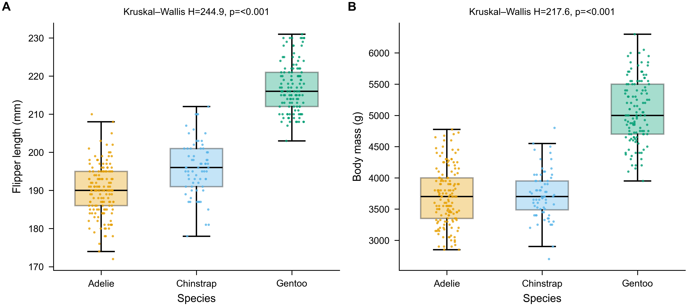
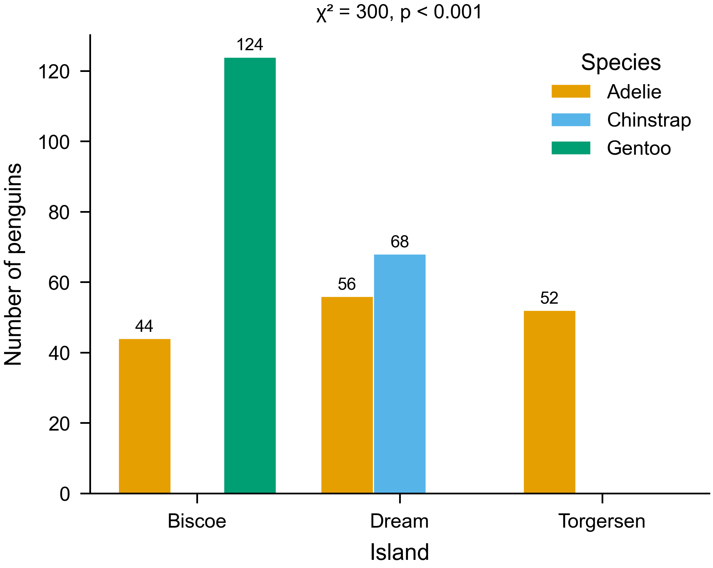
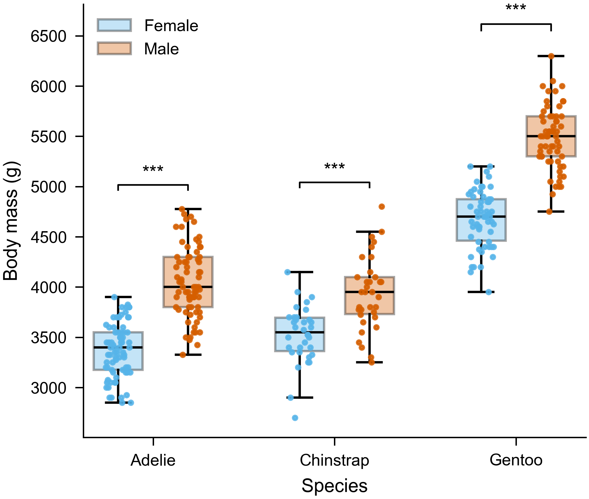

# Example — Sexual Dimorphism in Antarctic Penguins / 案例:南极企鹅的性二态

A complete worked example of the **paper-figures** skill, run end-to-end on a real,
openly licensed published dataset. / 在一个真实、开放许可的已发表数据集上,端到端运行
**paper-figures** 技能的完整案例。

## What this shows / 演示内容

The skill's full workflow on the Palmer Archipelago penguin data: read the data → frame
each figure → choose statistics & chart type → apply a journal preset → render with Python
→ self-check → export numbered assets → write a bilingual report.

技能在帕尔默群岛企鹅数据上的完整工作流:读数据 → 明确每张图 → 选统计与图型 → 套用期刊
预设 → Python 绘制 → 自检 → 编号导出 → 生成双语报告。

A gallery of **9 figures across 9 chart families** + **3 academic three-line tables**.
9 类图型 + 3 张三线表。

| Asset | File | Chart family / What it argues |
|---|---|---|
| **Fig 1** | [`Fig1.png`](figures/Fig1.png) | box + points — body size separates the species |
| **Fig 2** | [`Fig2.png`](figures/Fig2.png) | grouped box — males heavier than females (Welch t, Hedges' g) |
| **Fig 3** | [`Fig3.png`](figures/Fig3.png) | scatter + regression — culmen length vs depth, per-species fit + 95% CI |
| **Fig 4** | [`Fig4.png`](figures/Fig4.png) | raincloud (half-violin + box + points) — flipper-length distributions |
| **Fig 5** | [`Fig5.png`](figures/Fig5.png) | histogram + ECDF — body-mass distribution |
| **Fig 6** | [`Fig6.png`](figures/Fig6.png) | grouped bar — species counts per island (χ²) |
| **Fig 7** | [`Fig7.png`](figures/Fig7.png) | correlation heatmap — morphometric traits |
| **Fig 8** | [`Fig8.png`](figures/Fig8.png) | PCA biplot — species in morphometric space |
| **Fig 9** | [`Fig9.png`](figures/Fig9.png) | forest plot — dimorphism effect size (Hedges' g) per species |
| **Table 1** | [`Table1.docx`](figures/Table1.docx) | three-line (三线表) — morphometrics (mean±SD, n) by species × sex |
| **Table 2** | [`Table2.docx`](figures/Table2.docx) | three-line — sexual-dimorphism test results (t, df, p, g [95% CI]) |
| **Table 3** | [`Table3.docx`](figures/Table3.docx) | three-line — sample composition by species/island/sex |
| **Report (Word)** | [`Figure_Report.docx`](Figure_Report.docx) | **all figures embedded** + bilingual captions/annotations/citations |
| **Report (md)** | [`figure_report.md`](figure_report.md) | same content, Markdown version |

| | | |
|:---:|:---:|:---:|
|  |  |  |
| box + points | scatter + regression | raincloud |
|  |  |  |
| histogram + ECDF | correlation heatmap | PCA biplot |
|  |  |  |
| grouped bar | forest plot | grouped box (dimorphism) |

The tables are Word **三线表** (three rules only — top, under-header, bottom — no vertical
lines), the standard academic format. / 表格为标准学术**三线表**(仅顶线、表头下线、底线)。

## Reproduce it / 复现

```bash
pip install -r ../../paper-figures/requirements.txt   # numpy pandas matplotlib scipy scikit-learn python-docx
cd scripts
# figures
for f in make_fig*.py; do python "$f"; done
# three-line tables (Word)
for f in make_table*.py; do python "$f"; done
# assemble the Word report (embeds figures + tables)
python make_report.py
```

Outputs are written to `figures/`. A fixed random seed (`0`) makes the point-jitter
reproducible. / 输出写入 `figures/`,固定随机种子(`0`)保证抖动可复现。
(scikit-learn is used by Fig 8 / PCA; python-docx writes the three-line tables.)

## Files / 文件

```
penguins-sexual-dimorphism/
├── data/penguins_raw.csv                  # raw data (see attribution below)
├── scripts/
│   ├── _common.py                         # load + clean data; three-line-table helper
│   ├── make_fig1_morphometrics.py         # box + points
│   ├── make_fig2_dimorphism.py            # grouped box
│   ├── make_fig3_scatter_regression.py    # scatter + regression
│   ├── make_fig4_raincloud.py             # raincloud
│   ├── make_fig5_distribution.py          # histogram + ECDF
│   ├── make_fig6_bar_counts.py            # grouped bar
│   ├── make_fig7_corr_heatmap.py          # correlation heatmap
│   ├── make_fig8_pca.py                   # PCA biplot
│   ├── make_fig9_forest.py                # forest plot
│   ├── make_table1_summary.py             # three-line summary table
│   ├── make_table2_dimorphism_stats.py    # three-line test-results table
│   ├── make_table3_composition.py         # three-line composition table
│   └── make_report.py                     # assemble the Word report
├── figures/                               # generated Fig1–9 (pdf+png) + Table1–3 (docx/csv)
├── Figure_Report.docx                     # ★ Word report — figures embedded (stage-7 deliverable)
└── figure_report.md                       # same report in Markdown
```

---

## Source & attribution / 来源与署名

This example reuses a real published study and its openly licensed data. Please keep this
attribution if you reuse the example. / 本案例复用真实已发表研究及其开放许可数据,转用时请
保留以下署名。

**Paper / 论文** (text & figures licensed **CC BY 4.0**):

> Gorman KB, Williams TD, Fraser WR (2014). Ecological Sexual Dimorphism and Environmental
> Variability within a Community of Antarctic Penguins (Genus *Pygoscelis*). *PLOS ONE*
> 9(3): e90081. https://doi.org/10.1371/journal.pone.0090081

**Data / 数据** — collected by Dr. Kristen Gorman and the Palmer Station Antarctica LTER
(PAL-LTER), a member of the Long Term Ecological Research Network. Distributed via the
`palmerpenguins` R package (Horst AM, Hill AP, Gorman KB, 2020) under **CC0** (public
domain). / 数据由 Kristen Gorman 博士与帕尔默站南极长期生态研究项目(PAL-LTER)采集,
经 `palmerpenguins` 包以 **CC0**(公有领域)分发。

> Horst AM, Hill AP, Gorman KB (2020). palmerpenguins: Palmer Archipelago (Antarctica)
> penguin data. R package version 0.1.0. https://allisonhorst.github.io/palmerpenguins/
> doi:10.5281/zenodo.3960218

`data/penguins_raw.csv` is the unmodified `penguins_raw.csv` from that package (344 birds,
17 fields). The figures and analysis here are our own work, built from that raw data.
/ `data/penguins_raw.csv` 为该包中未经修改的原始文件(344 只,17 字段);本案例的图表与
分析为基于原始数据的再创作。

### License note / 许可说明
- The **data** is CC0 → free to redistribute, no permission needed; attribution kept as a courtesy.
- The **paper** is CC BY 4.0 → you may reuse with credit (given above).
- This example's **code** follows the repository's MIT license.

数据为 CC0,可自由再分发;论文为 CC BY 4.0,署名即可复用;本案例代码遵循仓库 MIT 许可。
